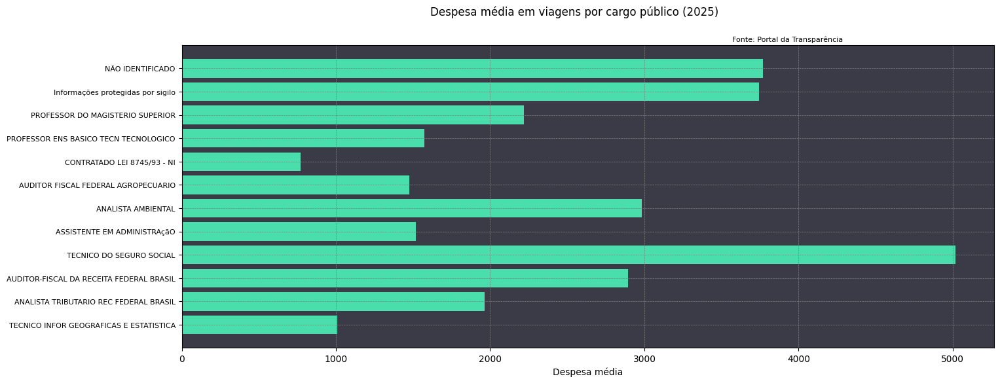

# ✈️ EDA: Análise de Despesas de Viagens Governamentais

<p align="left">
  
  
  
  
</p>

> **Objetivo:** Auditar e extrair inteligência de dados a partir do histórico de viagens abertas do Governo Federal (Portal da Transparência), mapeando a correlação entre cargos públicos e a média de despesas geradas.

## 📈 Visualização de Alto Impacto



## ⚙️ Desafios Técnicos e Metodologia (ETL e Análise)

O trabalho com bases de dados abertas governamentais exige rigorosas etapas de limpeza (ETL) e engenharia de *features*. Este projeto (desenvolvido em Jupyter Notebook) seguiu a seguinte arquitetura de dados:

1.  **Tratamento de Dados Regionais:** Resolução de inconsistências de importação do `pd.read_csv`, especificando *encoding* (`Windows-1252`), separadores e o padrão brasileiro de decimais (vírgula) para evitar a quebra de tipos numéricos.
2.  **Feature Engineering (Criação de Variáveis):**
    *   Criação da métrica financeira unificada `Despesas` (somando diárias, passagens e outros gastos).
    *   Derivação de dimensões temporais (`Mês da viagem` e `Dias de viagem`), processando a diferença absoluta de dias entre datas de ida e volta (`pd.to_datetime`).
3.  **Agregações Lógicas:** Uso intensivo do método `.agg()` no Pandas para gerar uma tabela consolidada simultânea, cruzando média de dias, despesa total, destino modal (mais frequente) e volume de viagens, tudo agrupado por `Cargo`.
4.  **Filtros Estatísticos de Relevância:** Aplicação de um filtro na base (isolando cargos que representam **>1% do volume total de viagens**) para eliminar *outliers* ruidosos e focar a visualização nos dados mais representativos para a administração pública.
5.  **Dataviz (Exportação):** Criação de um gráfico de barras horizontais utilizando `matplotlib`, estilizado sob uma paleta *dark* personalizada para leitura facilitada e exportado para compor painéis gerenciais.

## 📁 Estrutura de Diretórios

O *pipeline* de dados exige uma estrutura de pastas organizada para a correta entrada e saída de arquivos gerados (Tabelas Excel e PNGs).

```text
analise-portal-transparencia/
│
├── data/
│   └── 2025_Viagem.csv            # Dataset bruto de origem (Exemplo)
├── output/
│   ├── tabela_2025.xlsx           # Tabela filtrada agregada gerada pelo script
│   └── grafico_2025.png           # Visualização final gerada pelo matplotlib
│
├── EDA_Gastos_Governo.ipynb       # Notebook principal com o código de limpeza e EDA
├── requirements.txt               # Dependências do projeto (pandas, matplotlib)
└── README.md

```

## 🚀 Como Executar o Projeto

Caso queira reproduzir as etapas de limpeza e geração do gráfico:

1. Clone este repositório e instale as dependências:
```bash
pip install pandas matplotlib openpyxl

```


2. Faça o download do histórico de viagens do ano correspondente no [Portal da Transparência](https://portaldatransparencia.gov.br/) e coloque-o na pasta `data/`.
3. Abra o Jupyter Notebook `EDA_Gastos_Governo.ipynb`.
4. Altere a variável `ano` na primeira célula de código para refletir o ano do arquivo baixado.
5. Execute todas as células. O script automaticamente limpará os dados, aplicará os filtros estatísticos e despejará a tabela Excel e o gráfico `.png` final na pasta `output/`.

---

**Autor:** [Thiago Farias Lourenço](https://www.linkedin.com/in/thiagofarias1908/)
